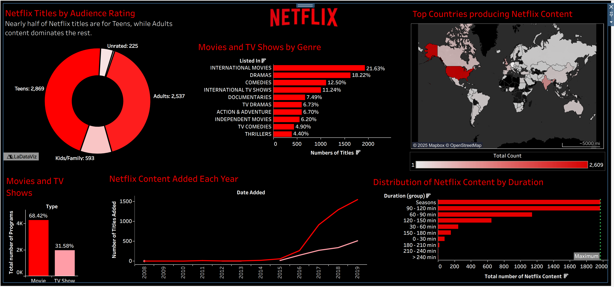

# Tableau-Netflix-Dashboard
This Tableau project explores Netflix's catalog by:
- Movies vs TV Shows
- Content growth by year
- Audience ratings
- Genres
- Duration
- Content distrubution based on countries

Dashboard Preview

Live Dashboard
Tableau: https://public.tableau.com/app/profile/sunil.sundas/viz/Book1_17572771563020/Dashboard1?publish=yes

Dataset: Kaggle
